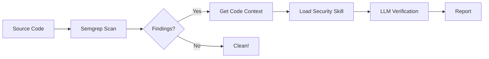

# Security Vulnerability Detection System

LLM과 MCP(Model Context Protocol)를 활용한 하이브리드 보안 취약점 탐지 시스템입니다.

## 📦 프로젝트 구조

```text
vuln-detector/
├── packages/
│   ├── mcp-core/        # 공유 타입 정의
│   ├── mcp-analysis/    # Semgrep 기반 정적 분석 MCP 서버
│   └── mcp-knowledge/   # 보안 가이드 Skills MCP 서버
├── apps/
│   └── workflow-controller/  # 메인 오케스트레이터
└── .env.example         # 환경 변수 템플릿
```

## 🚀 빠른 시작

### 1. 설치

```bash
cd vuln-detector
npm install
npm run build --workspaces
```

### 2. 환경 설정

```bash
# .env 파일 생성
cp .env.example .env

# API 키 설정
# .env 파일을 열어 ANTHROPIC_API_KEY 값을 입력하세요
```

### 3. 실행

```bash
# 특정 파일 스캔
node apps/workflow-controller/dist/index.js ./path/to/file.js

# 디렉토리 스캔
node apps/workflow-controller/dist/index.js ./src
```

## 🔧 MCP 서버 구성

### Analysis Server (`@vuln-detector/mcp-analysis`)

| Tool | 설명 |
|------|------|
| `run_scan` | Semgrep을 사용한 정적 분석 수행 |
| `get_file_context` | 취약점 주변 코드 컨텍스트 조회 |
| `list_supported_languages` | 지원 언어/프레임워크 목록 |

### Knowledge Server (`@vuln-detector/mcp-knowledge`)

| Tool | 설명 |
|------|------|
| `list_security_skills` | 사용 가능한 보안 스킬 목록 |
| `get_security_skill` | 특정 스킬 전체 내용 조회 |
| `get_skill_section` | 스킬 내 특정 섹션 조회 |
| `search_skills` | 키워드로 스킬 검색 |

## 📚 보안 Skills

| Skill | 설명 |
|-------|------|
| `javascript-secure-coding` | XSS, SQL Injection, Command Injection 등 JavaScript 보안 |
| `privacy-checklist` | 개인정보보호법 준수 체크리스트 |
| `ai-security-checklist` | AI/LLM 보안 및 AI 기본법 준수 |

## 🔍 작동 방식



1. **정적 분석**: Semgrep으로 잠재적 취약점 탐지
2. **컨텍스트 수집**: 탐지된 위치의 코드 조각 추출
3. **스킬 로드**: 취약점 유형에 맞는 보안 가이드 조회
4. **LLM 검증**: Claude로 실제 취약점 여부 판단
5. **보고서 생성**: 확인된 취약점 및 조치 방안 출력

## 📋 출력 예시

```
========================================
           FINAL REPORT
========================================

Total Findings: 3
Confirmed Vulnerabilities: 1
False Positives: 2

--- Confirmed Vulnerabilities ---

📛 javascript.express.security.injection.sqli
   File: src/api/users.js:42
   Confidence: High
   Reason: 사용자 입력이 SQL 쿼리에 직접 연결됨
   Remediation: Parameterized Query 사용 권장
   Reference: javascript-secure-coding/SQL Injection
```

## ⚙️ 개발

```bash
# 개별 패키지 빌드
npm run build -w @vuln-detector/mcp-analysis

# 전체 빌드
npm run build --workspaces
```

## 📄 라이선스

MIT
