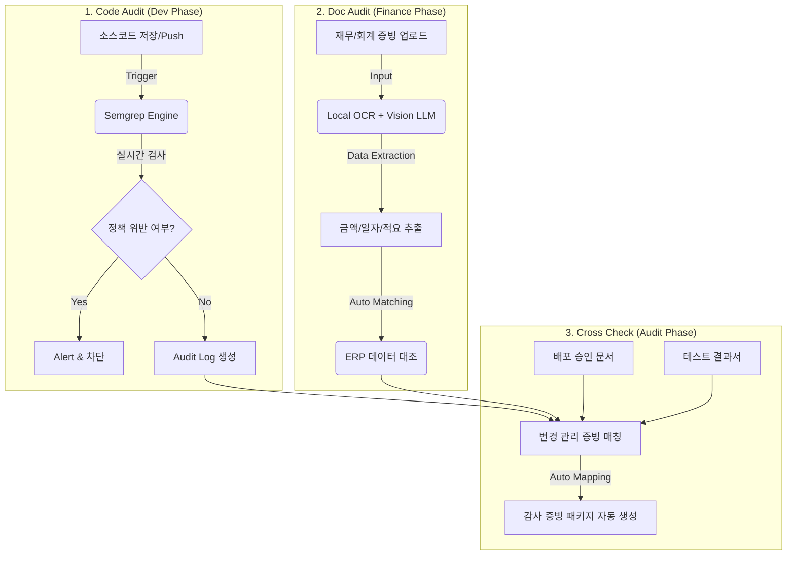
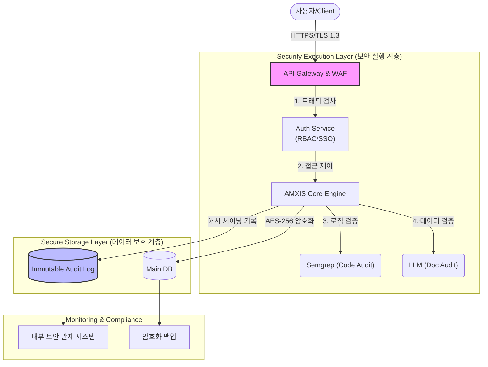

# AMXIS Audit Shield 서비스 기획서

## 1. 서비스 개요 (Service Overview)
**서비스명:** AMXIS Audit Shield (지능형 내부통제 및 증빙 자동화)

**핵심 컨셉 (Value Proposition):**
> "개발부터 회계 감사까지, 클릭 한 번으로 끝내는 내부통제"

**Killer Factor:**
개발자와 현업 담당자가 가장 기피하는 '증빙 수집'과 '감사 대응' 업무를 **Zero-Click**에 가깝게 자동화하여 플랫폼 의존도를 극대화하고 업무 효율성을 혁신적으로 개선합니다.

---

## 2. 타겟 고객 (Target Customer)

| 고객 유형 | 주요 니즈 (Needs) | 비고 |
| :--- | :--- | :--- |
| **Type 1 (도입사)** | **K-SOX(내부회계관리제도) 감사 필수** 기업 (상장사 등) | 감사 대응 비용 절감 및 리스크 최소화 |
| **Type 2 (효율화 기업)** | 증빙 누락으로 인한 재무팀-현업 간 갈등이 심한 기업 | 업무 프로세스 자동화 및 협업 비용 감소 |

---

## 3. 서비스 워크플로우 (Service Flow)

본 서비스는 개발 단계부터 증빙 관리까지 전 과정을 자동화하여, 별도의 수작업 없이 감사를 대비할 수 있는 체계를 제공합니다.

### 상세 프로세스
1.  **Code Audit (개발 단계)**:
    *   **Action**: AMXIS 내 소스코드 저장 또는 Git Push 시 작동.
    *   **Logic**: Semgrep 엔진이 사전 정의된 회계/보안 정책(결제 로직 변조, 권한 우회 등)을 기준으로 코드를 실시간 스캔(제공된 index.js 활용).
    *   **Result**: 위반 시 경고/차단, 통과 시 '코드 감사 로그' 자동 생성.
2.  **Doc Audit (재무 단계)**:
    *   **Action**: 각종 **증빙 문서** 및 이미지 업로드.
    *   **Logic**: Local OCR 및 Vision LLM이 이미지에서 핵심 데이터(금액, 일자, 적요)를 추출하여 ERP 상의 데이터와 자동 대조(Cross-validation).
    *   **Result**: 증빙 불일치 자동 탐지 및 정합성 검증 완료.
3.  **Cross Check (감사 대응 단계)**:
    *   **Action**: 정기 감사 시즌 또는 수시 점검.
    *   **Logic**: 코드 변경 이력(Git), 배포 승인 문서, 테스트 결과서, 재무 증빙을 자동으로 매핑.
    *   **Result**: "변경 관리 증빙" 패키지가 클릭 한 번으로 생성되어 외부 감사인에게 즉시 제출 가능.

---

## 4. 기술 스택 및 아키텍처 (Tech Stack & Architecture)

비용 효율성과 데이터 보안을 최우선으로 고려하여 **On-premise & Open Source** 기반으로 구성됩니다.

| 구성 요소 | 기술 스택 / 모델 | 특징 및 선정 사유 |
| :--- | :--- | :--- |
| **1. 코드/패턴 분석** (Code Audit) | **Semgrep (CLI)** | • **CPU 최적화**: 매우 가벼운 정적 분석 엔진으로 고사양 서버 불필요. • **보안/금칙어 검사**: 사전 정의된 Rule 기반으로 로직 위반 및 금칙어 초고속 탐지. |
| **2. 증빙 텍스트 추출** (Text Extraction) | **PaddleOCR** (CPU Mode) | • **백그라운드 처리**: GPU 없이도 영수증/문서 텍스트 추출 가능. • **비용 효율**: 실시간성보다는 처리량이 중요하므로 Queue 기반 비동기 처리로 리소스 최적화. |
| **3. 문맥 판단/요약** (Context AI) | **Phi-3-mini (GGUF)** (Run via Ollama) | • **경량화 LLM**: 3.8B 파라미터 수준으로 **메모리 4GB** 내외 구동 가능. • **사유서 분석**: 사유서의 적절성 판단 및 요약 업무에 충분한 성능 제공. |
| **4. 검색 및 질의** (RAG Engine) | **ChromaDB** | • **Metadata Filtering**: 증빙 검색 시 '날짜/부서' 필터링이 필수적이므로, 메타데이터 관리가 강력한 ChromaDB가 FAISS보다 유리. • **Easy Deployment**: Docker 컨테이너 하나로 임베딩 저장/조회를 통합 관리하여 운영 복잡도 최소화. |

---

## 5. 비용 효율성 분석 (Cost Analysis)

API 기반 상용 모델(GPT-4o 등) 대비 압도적인 비용 절감 효과를 제공합니다.

### 토큰 비용 시뮬레이션
*   **가정**: 사용자 5,000명, 월평균 증빙 20건, 건당 1,000 토큰 처리 시 = **월 1억 토큰 소요**

| 구분 | 상용 API (GPT-4o 기준) | AMXIS Local LLM | 비고 |
| :--- | :--- | :--- | :--- |
| **월간 비용** | 약 $1,500 (약 200만원) | **0원** | API 호출 비용 없음 |
| **초기 비용** | 없음 | **일반 CPU 서버 활용** | 고가 GPU 서버 불필요 (Phi-3-mini 활용) |
| **경제성 평가** | 사용량 증가 시 비용 선형 증가 | **사용량 무관 고정 비용** | 대규모 조직일수록 유리 |

---

## 6. 보안 아키텍처 및 실행 메커니즘 (Security Architecture & Execution)

### 6.1 보안 아키텍처 다이어그램 (Security Diagram)

### 6.2 보안 아키텍처 상세 (Security Deep Dive)

보안은 단순한 기능이 아니라 시스템의 핵심 설계 사상(Security by Design)으로 내재화되어 있습니다.

| 계층 (Layer) | 주요 보안 기술 (Key Technologies) | 상세 실행 내역 |
| :--- | :--- | :--- |
| **1. 네트워크 보안** (Network) | **mTLS & Private Subnet** | • **Zero Trust**: 내부 마이크로서비스 간 통신에도 mTLS(상호 인증)를 적용하여 내부망 장악 시에도 횡적 이동(Lateral Movement) 차단. • **망분리**: DB 및 AI 엔진은 인터넷이 차단된 Private Subnet에 배치. |
| **2. 애플리케이션 보안** (Application) | **Secure Coding & WAF** | • **OWASP Top 10 방어**: SQL Injection, XSS 등 10대 웹 취약점에 대한 자동화된 방어 로직 내장. • **Secure SDLC**: 개발 단계부터 Semgrep이 보안 취약점을 자동 제거한 코드만 배포. |
| **3. 데이터 보안** (Data Protection) | **AES-256 & PII Masking** | • **컬럼 단위 암호화**: 주민번호, 비밀번호 등 민감 정보는 DB 저장 시 즉시 AES-256 알고리즘으로 암호화(Key는 별도 분리 관리). • **마스킹**: 증빙 이미지 내 개인정보(카드번호 등)는 OCR 추출 즉시 비식별화 처리. |
| **4. 감사/무결성** (Audit Integrity) | **WORM & Hash Chaining** | • **불가역적 저장**: 감사 로그는 'Write Once, Read Many' 스토리지에 저장되어 관리자 권한으로도 위/변조 절대 불가. • **무결성 검증**: 로그 생성 시 이전 로그의 해시값을 포함(Block-chain 방식)하여 로그 삭제/조작 시도 즉시 탐지. |

---

## 7. 기대 효과 (Expected Benefits)

1.  **감사 대응 시간 90% 단축**: 수작업 증빙 캡처 및 정리 업무를 자동화.
2.  **휴먼 에러 제거**: AI 정밀 검증으로 감사 지적 사항 사전 예방.
3.  **조직 갈등 해소**: 시스템 기반 증빙으로 부서 간 마찰 해결.
4.  **보안성 강화**: 내부 통제 정책 강제화를 통한 부정 행위 기술적 차단.

---

## 8. 내부통제 미준수 리스크 분석 (Risk Analysis)

*   **상장사 리스크**: 감사비적정 시 투자주의 환기종목 지정 및 상장폐지 심사 위험.
*   **재무 리스크**: 횡령/배임 사고에 따른 손실 및 과태료.
*   **세무 리스크**: 증빙 불비로 인한 비용 부인 및 가산세.
*   **평판/운영 리스크**: 투자자 신뢰 하락 및 조직 내 피로도 증가.

---

## 9. 도입 전후 비용-효과 비교 (Cost-Benefit Analysis)

*   **초기 투자비 88% 절감**: 자체 개발(약 2.5억) vs AMXIS 도입(약 0.3억).
*   **구축 기간 90% 단축**: 평균 6~8개월 → 2~3주.
*   **총 비용(TCO) 효율**: 연간 비용 약 83% 절감 (6억 → 1억).

---

## 10. 배포 유연성 및 모델 비교 (Deployment Flexibility: On-prem vs SaaS)

### 10.1 배포 모델 비교 요약

| 구분 | **Type A: 구축형 (On-premise)** | **Type B: 서비스형 (SaaS)** |
| :--- | :--- | :--- |
| **추천 대상** | • **금융권, 공공기관, 대기업** • 망분리 규제로 인해 외부 통신이 불가능한 기업 | • **스타트업, 중견기업** • 초기 인프라 투자 비용을 최소화하고 싶은 기업 |
| **네트워크 환경** | **내부망 / 폐쇄망 (Air-gapped)** 인터넷 연결 없이 내부 서버 단독 구동 | **외부망 (Public Cloud)** 인터넷만 연결되면 어디서든 접속 가능 |
| **데이터 보관** | **고객사 사내 서버 저장** 외부 유출 원천 차단 (Data Sovereignty 100%) | **AMXIS 보안 클라우드 저장** AES-256 암호화 및 CSP(AWS/Azure) 보안 적용 |

### 10.2 SaaS 보안 및 벤치마킹 사례 (SaaS Security & Benchmarks)

SaaS 도입을 망설이는 기업을 위해 **'금융권 수준의 보안'**과 **'검증된 성공 사례'**를 제공합니다.

#### A. AMXIS SaaS 보안 매커니즘
AMXIS SaaS 버전은 클라우드 환경에서도 데이터 프라이버시를 완벽하게 보호하기 위해 Multi-Layer 보안을 적용합니다.

1.  **테넌트 격리 (Tenant Isolation)**: 고객사별 데이터베이스 또는 스키마를 논리적으로 완벽히 분리하여, 타사 데이터와의 혼용 가능성을 원천 차단합니다.
2.  **E2E 암호화 (End-to-End Encryption)**: 데이터 전송(TLS 1.3)부터 저장(AES-256)까지 전 구간 암호화하며, Key Management Service(KMS)를 통해 암호화 키를 안전하게 관리합니다.
3.  **데이터 익명화 (Anonymization)**: 증빙 내 주민번호, 카드번호 등 민감 정보는 저장 전 비식별화(Masking) 처리됩니다.

#### B. 유사 솔루션 운영 및 성공 사례 (Reference Cases)
민감한 기업 데이터를 다루면서도 성공적으로 SaaS 모델을 안착시킨 글로벌 벤치마킹 사례입니다.

| 솔루션명 | 서비스 특징 및 보안 사례 | 시사점 |
| :--- | :--- | :--- |
| **Vanta / Drata** | • **보안 인증(SOC2) 자동화 SaaS** • 기업의 클라우드(AWS/GCP) 설정을 읽어가지만, Read-only 권한과 로그 데이터 암호화를 통해 신뢰 확보. • 유니콘 기업으로 성장하며 **'보안 감사도 SaaS로 가능함'**을 입증. | 감사를 위한 내부 데이터 접근이 반드시 On-premise일 필요는 없음. **접근 통제**가 핵심. |
| **GitGuardian** | • **소스코드 내 Secret 탐지 SaaS** • 기업의 가장 중요한 자산인 소스코드를 스캔하지만, 코드를 서버에 영구 저장하지 않고 스캔 후 파기(Ephemeral)하는 정책으로 보안 우려 해소. | **데이터 최소 수집 원칙**을 통해 R&D 팀의 거부감 해소 가능. |
| **Expensify** | • **글로벌 지출결의/경비처리 SaaS** • 법인카드 내역 및 영수증 등 재무 데이터를 클라우드에서 처리. • PCI-DSS 인증 및 철저한 감사 로그 제공으로 글로벌 표준으로 자리매김. | **재무 데이터의 클라우드 처리**에 대한 시장의 심리적 장벽이 이미 낮아짐. |
