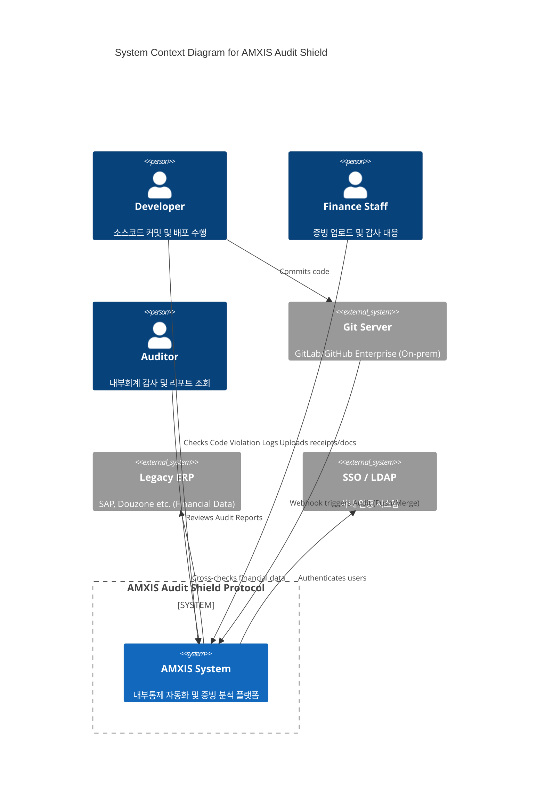
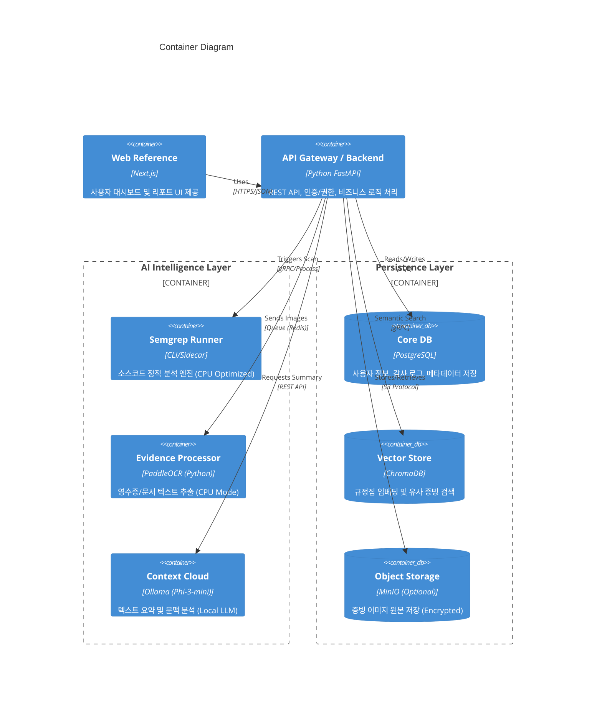
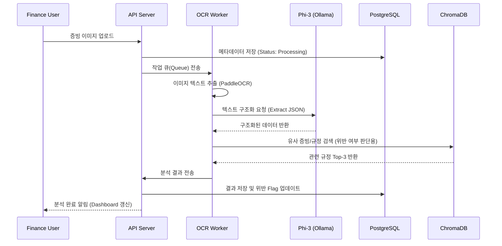

# AMXIS Audit Shield System Architecture

## 1. 아키텍처 개요 (Architecture Overview)

**AMXIS Audit Shield**는 민감한 재무 및 소스코드 데이터를 다루므로 **보안성(Security), 독립성(Isolation), 경량화(Lightweight)**를 3대 원칙으로 설계되었습니다.

### 1.1 핵심 설계 원칙
*   **On-premise First**: 외부 인터넷 연결이 차단된 폐쇄망에서도 100% 기능 동작.
*   **Zero Data Leakage**: 데이터의 외부 유출 경로를 원천 차단 (Local LLM/OCR 사용).
*   **Resource Optimized**: 고가의 GPU 장비 없이 일반 CPU 서버에서 구동 가능한 경량 모델 채택.

---

## 2. 시스템 컨텍스트 (System Context - Top Level)

---

## 3. 컨테이너 아키텍처 (Container Architecture)

시스템은 **Docker Compose** 기반의 마이크로서비스 구조로 배포되며, 크게 **Frontend, Backend, AI Engine, Persistence** 계층으로 나뉩니다.

---

## 4. 컴포넌트 상세 설계 (Component Design)

### 4.1 Code Audit Engine
*   **Tech**: Semgrep CLI
*   **Role**: Git Webhook 수신 시 트리거되어 변경된 코드의 AST(Abstract Syntax Tree)를 분석.
*   **Ruleset**: `rule.yaml` 파일로 관리되며, 재무 로직 변조(e.g., `if (amount > limit) bypass()`) 패턴을 탐지.
*   **Optimization**: 변경된 파일만 검사하는 Incremental Scan 적용.

### 4.2 Evidence Processor
*   **Tech**: PaddleOCR (Detection/Recognition) + Phi-3-mini
*   **Process**:
    1.  **Preprocessing**: 이미지 노이즈 제거 및 회전 보정.
    2.  **OCR**: 텍스트 및 좌표 추출 (CPU 병렬 처리).
    3.  **Parsing (LLM)**: 추출된 텍스트 파편(Tokens)을 Phi-3-mini에 입력하여 `{"date": "...", "amount": 10000, "vendor": "..."}` 형태의 JSON으로 구조화.

### 4.3 RAG Engine (ChromaDB)
*   **Tech**: ChromaDB + Hybrid Search
*   **Role**: 과거 감사 지적 사례 및 내부 회계 규정 검색.
*   **Filtering**: `where={"dept": "finance", "year": "2024"}`와 같은 메타데이터 필터링을 통해 검색 정확도 향상.

---

## 5. 데이터 흐름 (Data Flow)

### Scenario: 증빙 자동 감사 (Auto Audit Flow)

---

## 6. 인프라 요구사항 (Infrastructure Requirements)

**Minimum Hardware Specs (On-premise)**

| 구분 | 사양 (Specification) | 비고 |
| :--- | :--- | :--- |
| **CPU** | 8 Core 이상 (Modern Arch) | AVX2 지원 권장 (OCR/Vector 연산 가속) |
| **RAM** | 32GB 이상 | LLM(4GB) + ChromaDB + App + OS |
| **Storage** | SSD 500GB 이상 | DB 및 증빙 이미지 저장 공간 |
| **Network** | 1Gbps Internal LAN | 외부 인터넷 연결 불필요 (Air-gapped) |
| **OS** | Linux (Ubuntu 22.04 LTS) | Docker Engine 필수 설치 |

---

## 7. 보안 설계 (Security Implementation)

*   **Ingress**: Nginx Reverse Proxy (TLS 1.3 Termination).
*   **Internal**: 컨테이너 간 통신은 Docker Internal Network 내에서만 허용.
*   **Storage**: MinIO 및 PostgreSQL 데이터 볼륨은 호스트 레벨에서 LUKS 암호화 적용 권장.
*   **Audit Trail**: 모든 API 요청은 Hash Chaining되어 `audit_logs` 테이블에 위변조 불가능한 상태로 기록.
