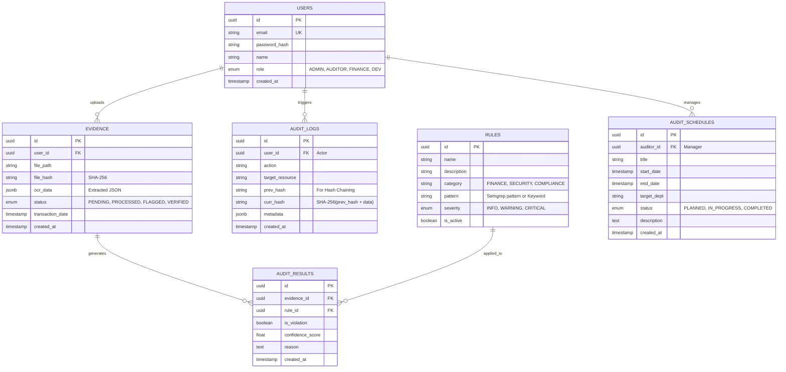

# AMXIS Audit Shield Database Schema

## 1. 개요 (Overview)
AMXIS Audit Shield는 **관계형 데이터(PostgreSQL)**와 **벡터 데이터(ChromaDB)**를 혼합하여 사용합니다.
*   **PostgreSQL**: 사용자 정보, 증빙 메타데이터, 감사 로그, 감사 규칙 등 정형 데이터 저장.
*   **ChromaDB**: 증빙 텍스트 임베딩, 감사 규정 벡터 등 비정형 데이터 검색용 저장소.

---

## 2. PostgreSQL Schema (Relational Data)

### 2.1 Entity Relationship Diagram (ERD)



### 2.2 Table Definitions

#### A. Users (사용자)
시스템 접근 권한을 관리합니다.
*   `role`: RBAC 구현을 위한 역할 (관리자, 감사인, 재무담당, 개발자).

#### B. Evidence (증빙)
업로드된 증빙(영수증, 지출결의서 등)의 원본과 추출된 데이터를 관리합니다.
*   `file_hash`: 원본 파일의 위변조 여부 검증용.
*   `ocr_data`: PaddleOCR + LLM을 통해 추출된 정형 데이터 (`{"amount": 1000, "vendor": "..."}`).

#### C. Rules (감사 규칙)
Semgrep 패턴이나 문맥 분석을 위한 키워드/가이드라인을 저장합니다.
*   `pattern`: Semgrep YAML 패턴 또는 자연어 가이드라인.

#### D. Audit Results (감사 결과)
증빙별 위반 사항을 기록합니다.
*   `confidence_score`: AI 판단의 신뢰도.

#### E. Audit Logs (감사 추적)
**보안** 핵심 테이블. 모든 중요 행위를 **Hash Chaining** 기법으로 기록합니다.
*   `prev_hash`: 이전 로그의 해시값을 포함하여 체인 형성 → 중간 로그 삭제/변조 시 체인 붕괴로 탐지 가능.

#### F. Audit Schedules (감사 일정)
정기 및 수시 감사 일정을 관리합니다.
*   `auditor_id`: 감사를 주관하는 담당 감사인(FK).
*   `status`: 감사의 현재 진행 단계 (계획됨, 진행중, 완료됨).

---

## 3. ChromaDB Schema (Vector Data)

ChromaDB는 Collection 단위로 관리되며, 메타데이터 필터링을 위한 스키마 설계가 중요합니다.

### 3.1 Collections

#### A. `evidence_vectors` (과거 증빙)
과거의 승인/반려된 증빙 데이터를 임베딩하여, 새로운 증빙이 들어왔을 때 유사 사례를 검색합니다.

| Field | Type | Description |
| :--- | :--- | :--- |
| **id** | string | `Evidence.id` (PostgreSQL FK) |
| **embedding** | vector[384] | `ocr_data` 텍스트의 임베딩 (Phi-3 or SBERT) |
| **document** | text | OCR 추출 텍스트 원문 (검색 매칭용) |
| **metadata** | json | 필터링용 메타데이터 |

**Metadata Structure:**
```json
{
  "year": 2024,
  "month": 3,
  "dept": "Development",
  "vendor": "AWS",
  "status": "VERIFIED"
}
```
*   **활용**: "개발팀에서 AWS 결제가 승인된 유사 사례 검색" (`where={"dept": "Development", "vendor": "AWS", "status": "VERIFIED"}`)

#### B. `compliance_vectors` (규정집)
내부 회계 관리 규정 및 가이드라인을 청크(Chunk) 단위로 임베딩합니다.

| Field | Type | Description |
| :--- | :--- | :--- |
| **id** | string | 규정 조항 ID (e.g., "REG-2024-001") |
| **embedding** | vector[384] | 규정 내용 임베딩 |
| **document** | text | 규정 원문 |
| **metadata** | json | 카테고리 정보 |

**Metadata Structure:**
```json
{
  "category": "Limit",
  "severity": "CRITICAL",
  "revision_date": "2024-01-01"
}
```
*   **활용**: "접대비 한도 초과 시 적용되는 규정 검색"

---

## 4. 데이터 정합성 전략 (Consistency Strategy)

### 4.1 Syncing PostgreSQL & ChromaDB
*   **Trigger-based**: PostgreSQL의 `Evidence` 테이블에 데이터가 Insert/Update 될 때, 비동기 작업(Worker)이 트리거되어 ChromaDB에 임베딩을 생성/갱신합니다.
*   **Soft Delete**: PostgreSQL에서 증빙이 삭제되면(Soft Delete), ChromaDB에서도 해당 벡터를 마킹하거나 삭제하여 검색 결과의 정합성을 유지합니다.
