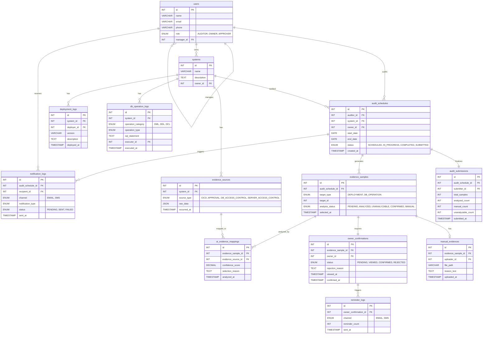
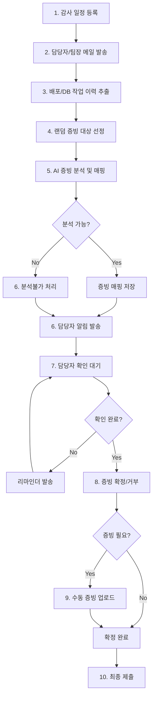

# AMXIS Audit Shield System Database Schema Implementation Plan

## 개요

감사(Audit) 업무를 위한 데이터베이스 스키마를 설계합니다. 10가지 핵심 비즈니스 요구사항을 충족하는 테이블 구조를 제안합니다.

## 비즈니스 요구사항 분석

| 번호 | 요구사항 | 필요 테이블 |
|------|----------|-------------|
| 1 | 감사 일정 등록 (대상 시스템/담당자/기간) | `audit_schedules`, `systems`, `users` |
| 2 | 담당자 및 상위 결재자(팀장)에게 메일 공유 | `notification_logs`, `users` (role 포함) |
| 3 | 배포 내역 및 DB DML/DDL/DCL 리스트 추출 | `deployment_logs`, `db_operation_logs` |
| 4 | Random 증빙 대상 리스트 Select | `evidence_samples` |
| 5 | AI 분석으로 증빙 매핑 (CI/CD, 전자결재, DB/서버 접근제어) | `evidence_sources`, `ai_evidence_mappings` |
| 6 | 분석 불가 항목 업데이트 및 담당자 알림 | `evidence_samples`, `notification_logs` |
| 7 | 담당자 확인 여부 관리 및 리마인더 발송 | `owner_confirmations`, `reminder_logs` |
| 8 | 담당자 증빙 확정 처리 | `owner_confirmations` |
| 9 | 담당자 직접 증빙 업로드/사유 작성 | `manual_evidences` |
| 10 | 최종 제출 | `audit_submissions` |

---

## Proposed Changes

### Core Tables (Steps 1-4)

#### [NEW] [audit_shield_schema.sql](file:///Users/jbs/PJT_AI/CEPF/db/audit_shield_schema.sql)

1. **`users`** - 사용자 (담당자, 팀장, 감사자)
   - 역할(role): `AUDITOR`, `OWNER`, `APPROVER(팀장)`
   - 상위 결재자 참조 (`manager_id`)

2. **`systems`** - 감사 대상 시스템
   - 시스템명, 설명, 담당자 참조

3. **`audit_schedules`** - 감사 일정
   - 감사자, 대상 시스템, 담당자, 감사 기간
   - 상태(status): `SCHEDULED`, `IN_PROGRESS`, `COMPLETED`, `SUBMITTED`

4. **`notification_logs`** - 메일/문자 알림 이력
   - 감사 일정 참조, 수신자, 발송 채널(EMAIL/SMS), 발송 상태

5. **`deployment_logs`** - 배포 이력
   - 시스템 참조, 배포자, 배포 시간, 버전, 설명

6. **`db_operation_logs`** - DB 작업 이력
   - 시스템 참조, 작업 유형 (DML/DDL/DCL), SQL문, 실행자

7. **`evidence_samples`** - 증빙 대상 (랜덤 선택된 항목)
   - 감사 일정 참조, 대상 유형, 대상 ID
   - **분석 상태**: `PENDING`, `ANALYZED`, `UNANALYZABLE`, `CONFIRMED`, `MANUAL`

---

### AI Analysis & Evidence Tables (Steps 5-6)

8. **`evidence_sources`** - 증빙 소스 데이터
   - 시스템 참조
   - 소스 유형: `CICD`, `APPROVAL`, `DB_ACCESS_CONTROL`, `SERVER_ACCESS_CONTROL`
   - 원본 데이터 (JSON), 발생 시간

9. **`ai_evidence_mappings`** - AI 분석 결과 (증빙 매핑)
   - evidence_sample 참조
   - evidence_source 참조 (매핑된 증빙)
   - AI 분석 신뢰도 (confidence_score)
   - 매핑 사유 (selection_reason)
   - 분석 시간

---

### Owner Confirmation Workflow (Steps 7-9)

10. **`owner_confirmations`** - 담당자 확인 이력
    - evidence_sample 참조
    - 확인 상태: `PENDING`, `VIEWED`, `CONFIRMED`, `REJECTED`
    - 확인 시간, 거부 사유

11. **`reminder_logs`** - 리마인더 발송 이력
    - owner_confirmation 참조
    - 발송 채널, 발송 시간, 발송 횟수

12. **`manual_evidences`** - 담당자 직접 증빙
    - evidence_sample 참조
    - 파일 경로 또는 텍스트 사유
    - 업로드 시간

---

### Final Submission (Step 10)

13. **`audit_submissions`** - 최종 제출
    - audit_schedule 참조
    - 제출자, 제출 시간
    - 전체 통계 (분석완료/수동증빙/분석불가 건수)

---

## 스키마 설계 (ERD)

---

## 프로세스 흐름도

---

## Verification Plan

### 스키마 검증

1. **SQL 문법 검증**
   - MySQL 또는 PostgreSQL에서 스키마 생성 테스트
   - 명령어: `mysql -u root -p < audit_shield_schema.sql`

2. **참조 무결성 검증**
   - 모든 Foreign Key 제약 조건이 올바르게 설정되었는지 확인
   - CASCADE DELETE 동작 테스트

3. **비즈니스 로직 시뮬레이션**

| 단계 | 테스트 내용 | 테이블 |
|------|-------------|--------|
| 1-2 | 감사 일정 등록 및 알림 발송 | `audit_schedules`, `notification_logs` |
| 3 | 기간별 배포/DB 작업 조회 | `deployment_logs`, `db_operation_logs` |
| 4 | 랜덤 샘플링 쿼리 | `evidence_samples` |
| 5-6 | AI 분석 결과 저장 | `ai_evidence_mappings`, `evidence_sources` |
| 7 | 리마인더 발송 로직 | `reminder_logs` |
| 8 | 확정/거부 상태 업데이트 | `owner_confirmations` |
| 9 | 수동 증빙 업로드 | `manual_evidences` |
| 10 | 최종 제출 및 통계 | `audit_submissions` |

### Manual Verification (User)

스키마 파일 생성 후 위 ERD와 프로세스 흐름도가 비즈니스 요구사항과 일치하는지 검토해 주세요.
