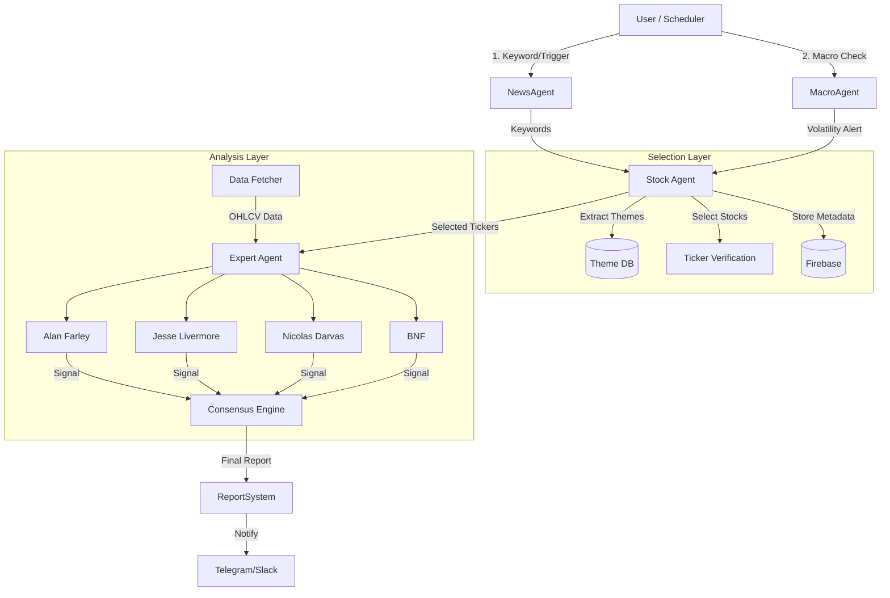

# Stock & Coin Analyst System Architecture

## Overview
This system is an automated trading analysis platform designed to:
1.  Collect news and economic data.
2.  Select themes and stocks based on keywords/trends.
3.  Analyze charts using expert strategies (Farley, Livermore, Darvas, BNF).
4.  Generate buy/sell signals with specific entry/exit points.

## Core Pillars (Skills)

Based on `Stock & coin Analyst.md`, the system is divided into 4 main skills (modules):

### 1. Information Scrap (Skill 1)
**Goal**: Collect relevant news based on keywords.
- **Targets**: Naver News (KR), NewsAPI.org (Global/EN).
- **Module**: `src/agent/news_agent` (Existing, to be enhanced).
- **Responsibilities**:
    - Fetch news by keyword.
    - Translate if necessary (EN -> KR).
    - Summarize content.

### 2. Economic Indicators (Skill 2)
**Goal**: Monitor macro-economic factors.
- **Targets**:
    - Commodities (Gold, Silver, Oil).
    - Crypto (BTC, ETH, etc.).
    - Fed Policy triggers.
    - Geopolitical issues (US/EU/JP/CN/KR).
    - Major Indices (KOSPI, NASDQ) > 1% volatility checks.
- **Module**: `src/agent/macro_agent` (New).
- **Responsibilities**:
    - Periodic fetching of key indices/commodities.
    - Volatility alerts.

### 3. Theme & Stock Selection (Skill 3)
**Goal**: Convert keywords/news into actionable stock targets.
- **Logic**:
    - Keyword -> Theme -> Stocks (Max 3 per theme).
    - Verify stock existence (Ticker check).
    - Store metadata in Firebase.
- **Module**: `src/agent/stock_agent` (Refactor existing).
- **Responsibilities**:
    - Manage Reference Data (Theme-Stock mapping).
    - Verify tickers.
    - Database interaction (Firebase).

### 4. Expert Strategy Analysis (Skill 4)
**Goal**: Technical analysis and Trade Signal generation.
- **Experts**: Alan S. Farley, Jesse Livermore, Nicolas Darvas, BNF.
- **Logic**:
    - **Buy Signal**: Consensus of 3+ experts.
        - Entry Price: Average of experts' suggested entries.
    - **Risk Control**: Re-evaluate if downtrend or high point.
    - **Sell Signal**:
        - Target/Stop-loss calculated by each expert algorithm.
        - Final Exit: Average of experts' exit points.
- **Module**: `src/agent/expert_agent` (New).
- **Responsibilities**:
    - Implement 4 distinct strategy classes.
    - `ConsensusEngine`: Aggregates votes and calculates averages.
    - Generate final Report.

## System Architecture



## Directory Structure Plan

```
src/
├── main_system.py          # Unified Entry Point (Scheduler/Trigger)
├── common/                 # Shared utilities
│   ├── firebase.py
│   └── logger.py
├── agent/
│   ├── news_agent/         # Skill 1: News Scraping
│   │   ├── collectors/
│   │   └── processor.py
│   ├── macro_agent/        # Skill 2: Economic Indicators
│   │   └── monitor.py
│   ├── stock_agent/        # Skill 3: Theme/Stock Selection
│   │   ├── theme_repo.py   # Theme mappings
│   │   └── verifier.py     # Ticker check
│   └── expert_agent/       # Skill 4: Technical Analysis
│       ├── strategies/
│       │   ├── farley.py
│       │   ├── livermore.py
│       │   ├── darvas.py
│       │   └── bnf.py
│       └── consensus.py
└── run_system.py           # (Deprecated/Refactored into main_system.py)
```

## Refactoring Plan

1.  **Restructure Directories**: Create `macro_agent`, `expert_agent`. Move relevant files.
2.  **Refactor StockAgent**: Focus on "Theme -> Stock" selection and Firebase storage (Skill 3). Remove heavy analysis logic (move to ExpertAgent).
3.  **Implement ExpertAgent**: Port/Create the 4 expert strategies. Implement the consensus logic (Skill 4).
4.  **Integrate**: Create `main_system.py` to orchestrate the flow: News -> Stock Selection -> Expert Analysis.
