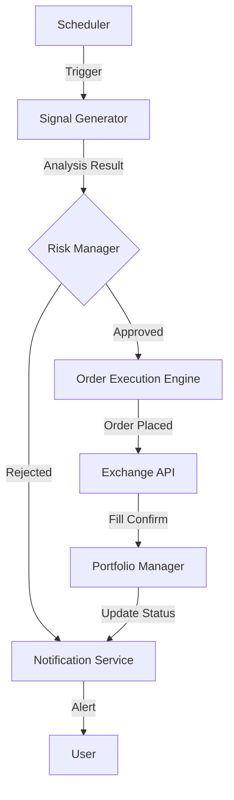

# Automated Trading System Architecture

## 1. Overview
The **Automated Trading System (ATS)** builds upon the existing `Stock & Coin Analyst` logic (Skills 1-4) to execute trades autonomously. It introduces a modular architecture separating analysis, risk management, and execution.

## 2. System Components

### 2.1 Scheduler (Workflow Controller)
- **Role**: Orchestrates the entire trading lifecycle.
- **Function**: Triggers analysis pipelines based on configured intervals (e.g., every 15 mins for crypto, daily for stocks).
- **Tech**: `APScheduler` or `asyncio` loop.

### 2.2 Signal Generator (Existing Skills 1-4)
- **Role**: Analyzes market data and generates `BUY/SELL/HOLD` signals.
- **Input**: Market data (News, Macro, Price).
- **Output**: `Signal` object (Asset, Type, Entry, Stop Loss, Take Profit, Confidence).

### 2.3 Risk Manager (Gatekeeper)
- **Role**: Validates signals against account limits and risk rules.
- **Rules**:
  - **Max Drawdown Limit**: Stop trading if daily loss > X%.
  - **Position Sizing**: Allocate max Y% of capital per trade.
  - **Correlation Check**: Avoid over-exposure to correlated assets.
- **Input**: `Signal`, Account Balance.
- **Output**: `ValidatedOrder` (or Rejected).

### 2.4 Order Execution Engine (Executor)
- **Role**: Interfaces with exchange APIs to place orders.
- **Modes**:
  - **Paper Trading**: Virtual execution for testing.
  - **Live Trading**: Real API calls (Upbit, Binance, Kiwoom).
- **Features**:
  - Retry mechanism for failed API calls.
  - Slippage control (Limit orders vs Market orders).

### 2.5 Portfolio Manager (Tracker)
- **Role**: Tracks active positions and PnL.
- **Function**:
  - Monitors open orders.
  - Updates stop-loss (Trailing Stop).
  - Calculates Realized/Unrealized PnL.

### 2.6 Notification Service (Alerts)
- **Role**: Sends real-time updates to the user.
- **Channels**: Telegram, Slack, Email.
- **Events**: Buy/Sell execution, Stop Loss triggered, Daily PnL report.

## 3. Data Flow



## 4. Technology Stack
- **Language**: Python 3.10+
- **Analysis**: `pandas`, `ta-lib`, `yfinance`
- **Scheduler**: `APScheduler`
- **Database**: `SQLite` (Local) or `Firebase` (Remote) for trade history
- **Exchange APIs**: `pyupbit`, `ccxt` (Crypto), `kiwoom` (Stocks - Windows only)
- **Notifications**: `python-telegram-bot`

## 5. Directory Structure
```
src/
├── auto_trading/
│   ├── main.py             # Entry point
│   ├── scheduler.py        # Job scheduling
│   ├── risk_manager.py     # Risk rules
│   ├── portfolio.py        # Position tracking
│   ├── executor/
│   │   ├── base.py         # Abstract executor
│   │   ├── paper.py        # Mock executor
│   │   └── upbit.py        # Real implementation
│   └── notification.py     # Telegram/Slack adapter
```

## 6. Functional Requirements (Feature List)

| Feature | Description | Priority |
|:---|:---|:---|
| **Auto-Analysis** | Run Skills 1-4 periodically without user input | P0 |
| **Paper Trading** | Simulate trading with virtual money | P0 |
| **Risk Constraints** | Max 10% capital per trade, Max 3% loss per trade | P1 |
| **Exchange Integration** | Upbit (Crypto) & Kiwoom (Stock) | P1 |
| **Telegram Alerts** | Send buy/sell notifications | P1 |
| **Trailing Stop** | Adjust stop loss as price rises | P2 |
| **Dashboard** | Simple web UI for status monitoring | P3 |
