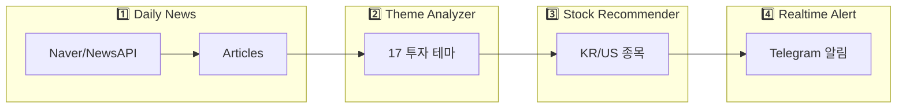

# News Agent Walkthrough

뉴스 기반 투자 알림 시스템의 전체 파이프라인 구현 및 테스트 결과입니다.

## 시스템 구조



---

## 구현 완료 모듈

| Phase | 모듈 | 파일 | 상태 |
|-------|------|------|------|
| 1-2 | Daily News Skill | `daily_news_skill.py` | ✅ |
| 3 | Theme Analyzer | `theme_analyzer.py`, `theme_taxonomy.py` | ✅ |
| 4 | Stock Recommender | `stock_database.py`, `stock_recommender_skill.py` | ✅ |
| 5 | Realtime Alert | `telegram_notifier.py`, `news_monitor.py`, `realtime_alert_skill.py` | ✅ |

---

## 테스트 결과

### 1. 모듈 임포트 테스트 ✅
- 11개 모듈 모두 정상 임포트
- `theme_taxonomy`: 17개 테마 정의
- `stock_database`: 테마별 KR/US 3종목씩 매핑

### 2. Stock Recommender 테스트 ✅
| 테마 | 한국 | 미국 |
|------|------|------|
| 전쟁/분쟁 | 한화에어로스페이스, LIG넥스원, 한국항공우주 | 록히드마틴, RTX, 노스롭그루만 |
| 금융시장 | KT, SK텔레콤, 현대차 | SPY, VIX, TLT |
| AI기술 | NAVER, 카카오, SK하이닉스 | MSFT, GOOGL, NVDA |

### 3. News Monitor 테스트 ✅
| 뉴스 | 테마 감지 | 긴급 |
|------|----------|------|
| 중동 사드·패트리어트 배치 | defense_war | 🚨 |
| 코스피 5% 급락 사이드카 | finance_market | 🚨 |
| SK하이닉스 HBM 증가 | semiconductor_ai | - |
| 네이버 AI 서비스 출시 | ai_tech | - |

### 4. Telegram 메시지 포맷 ✅

```
⚔️ [전쟁/분쟁] 테마 알림
⏰ 02:26

📰 중동 美기지에 사드·패트리어트 추가 배치
🔗 기사 보기

🇰🇷 한국 관련주
• 한화에어로스페이스 (012450)
  └ K방산 대표주...

🇺🇸 미국 관련주
• 록히드마틴 (LMT)
  └ 세계 최대 방산업체...

#투자알림 #전쟁_분쟁
```

### 5. E2E 통합 테스트 ✅
- **입력**: 뉴스 제목
- **처리**: 테마 감지 → 긴급 판정 → 종목 추천 → 알림 생성
- **결과**: 2개 테스트 뉴스 모두 정확히 처리됨

---

## 사용법

```bash
# 1️⃣ 뉴스 수집
python3 -m src.agent.news_agent.daily_news_skill

# 2️⃣ 테마 분석
python3 -m src.agent.news_agent.theme_analyzer_skill

# 3️⃣ 종목 추천
python3 -m src.agent.news_agent.stock_recommender_skill

# 4️⃣ 실시간 알림 (테스트)
python3 -m src.agent.news_agent.realtime_alert_skill --test

# 4️⃣ 실시간 알림 (데몬)
python3 -m src.agent.news_agent.realtime_alert_skill --daemon
```

---

## 다음 단계 (Phase 6-8)

- **Phase 6**: 주가 데이터 연동 (야후 파이낸스/네이버 증권)
- **Phase 7**: 성과 추적 대시보드
- **Phase 8**: 매매 시그널 생성
