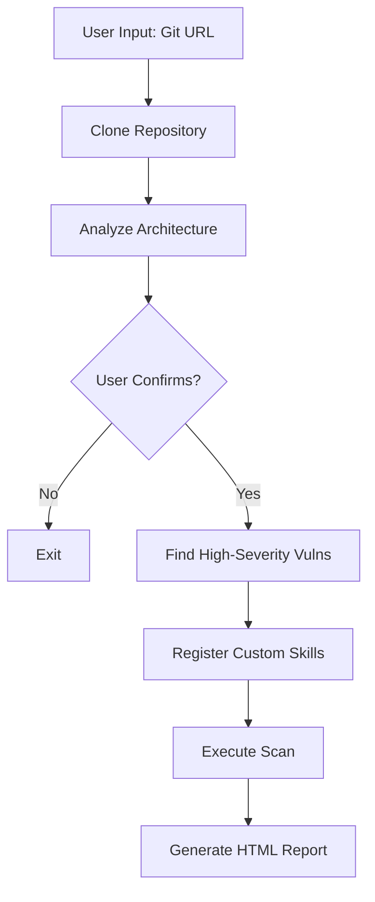

# Walkthrough: Advanced Vulnerability Scanning Workflow

## Summary
Successfully implemented a new process for the vulnerability scanning system that:
1. Accepts a Git URL as input
2. Downloads and analyzes source code architecture
3. Identifies high-severity vulnerabilities (CVSS >= 8) based on architecture
4. Registers custom vulnerability skills
5. Generates a comprehensive security report

## Changes Made

### New Files Created

| File | Purpose |
|------|---------|
| [vulnerabilities.json](file:///Users/jbs/PJT_AI/react-security-test/vulnerabilities.json) | External JSON file containing all vulnerability definitions (enables dynamic loading & hot-reload) |
| [advanced_scan_flow.js](file:///Users/jbs/PJT_AI/react-security-test/advanced_scan_flow.js) | CLI workflow script that orchestrates the entire scanning process |

### Modified Files

| File | Changes |
|------|---------|
| [mcp-server.js](file:///Users/jbs/PJT_AI/react-security-test/mcp-server.js) | Refactored to load vulnerabilities from `vulnerabilities.json` instead of hardcoded definitions. Added hot-reload capability via `fs.watchFile`. |

render_diffs(file:///Users/jbs/PJT_AI/react-security-test/mcp-server.js)

## How to Run

```bash
cd /Users/jbs/PJT_AI/react-security-test
node advanced_scan_flow.js
```

The script will:
1. Prompt for a Git repository URL
2. Clone the repository to `.scan_workspace/`
3. Analyze the architecture (languages, frameworks, DB, risk factors)
4. Display analysis and ask for user confirmation
5. Find high-severity vulnerabilities based on the architecture
6. Register any custom vulnerabilities to `vulnerabilities.json`
7. Generate an HTML report in `.scan_workspace/`

## Verification

- ✅ Syntax check passed for `mcp-server.js`
- ✅ Syntax check passed for `advanced_scan_flow.js`
- ✅ Vulnerabilities load correctly from JSON file
- ✅ Hot-reload mechanism implemented for vulnerability updates

## Architecture


