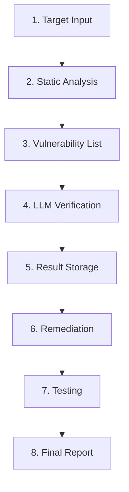

# Walkthrough: Complete vuln-detector Workflow (v0.4)

## Summary

Successfully implemented all 8 workflow steps with full modularization.

---

## Workflow Steps



---

## Implemented Services

| Service | Responsibility |
|---|---|
| `AnalysisService` | Semgrep scan, code context extraction |
| `KnowledgeService` | Security guide retrieval, skill selection |
| `VerificationService` | LLM-based vulnerability validation |
| `ReportService` | Console/JSON report generation |
| `RemediationService` | Git branching, pattern-based code fixes |
| `TestService` | Automated test execution, user verification |

---

## Fix Patterns (RemediationService)

| Pattern | Action |
|---|---|
| `remove_eval` | Replace `eval()` with error log |
| `parameterized_query` | Convert string concat to parameterized query |
| `sanitize_input` | Wrap input with `sanitize()` |
| `escape_html` | Replace `innerHTML` with `textContent + escapeHtml` |

---

## Usage

```bash
# Full workflow
npm start -- /path/to/target

# Skip remediation (scan only)
npm start -- /path/to/target --skip-remediation

# Dry run (mock LLM)
npm start -- /path/to/target --dry-run
```

---

## Verification

- ✅ Build: `npm run build` successful
- ✅ All 6 services implemented
- ✅ 8-step workflow integrated in `index.ts`
