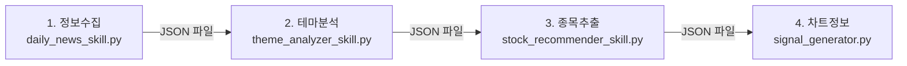

# Skill Integration Issue Analysis

## 현재 파이프라인 구조



## 발견된 문제점

### 1. 🔴 파이프라인 오케스트레이터 부재
각 스킬이 독립적으로 실행되며, 자동 연결 메커니즘이 없음.
- **현재**: 수동으로 4개 명령어를 순차 실행해야 함
- **필요**: 하나의 명령으로 전체 파이프라인 실행

### 2. 🔴 스킬 간 데이터 전달 방식
파일 기반 전달 (JSON) → 비효율적, 오류 발생 가능
- `theme_analyzer_skill`은 `collected_news/` 폴더에서 파일을 읽음
- `stock_recommender_skill`은 `theme_analysis_{date}.json`을 읽음
- 날짜 불일치, 파일 없음 등의 오류 발생 가능

### 3. 🟡 Signal Generator 통합 부재
`signal_generator.py`는 **독립된 모듈**로, `stock_recommender_skill` 결과와 연결되어 있지 않음.
- 추천된 종목을 받아서 시그널 분석하는 로직 없음
- CLI 인터페이스 없음 (테스트 코드만 존재)

### 4. 🟡 Headless 스크래핑 문제
네이버 뉴스 스크래핑이 헤드리스 모드에서 동작하지 않음.
- 검색/카테고리 수집 시 0개 결과 반환
- 봇 탐지로 인한 차단 추정

## 제안 해결 방안

### Option A: Pipeline Orchestrator 추가
```python
# stock_pipeline_skill.py (NEW)
class StockPipelineSkill:
    async def run(self, query: str):
        # 1. 뉴스 수집
        news = await DailyNewsSkill(query=query).run()
        # 2. 테마 분석
        themes = await ThemeAnalyzerSkill(articles=news).run()
        # 3. 종목 추천
        stocks = await StockRecommenderSkill(themes=themes).run()
        # 4. 시그널 생성
        signals = SignalGenerator().analyze_multiple(stocks)
        return signals
```

### Option B: MCP Tool 통합
각 스킬을 MCP Tool로 등록하여 에이전트가 자동으로 호출하도록 구성.

## 다음 단계
1. [ ] Pipeline Orchestrator 구현
2. [ ] 스킬 간 인메모리 데이터 전달 지원
3. [ ] Signal Generator CLI 추가
4. [ ] 스크래핑 안정성 개선 (Playwright 등 고려)
